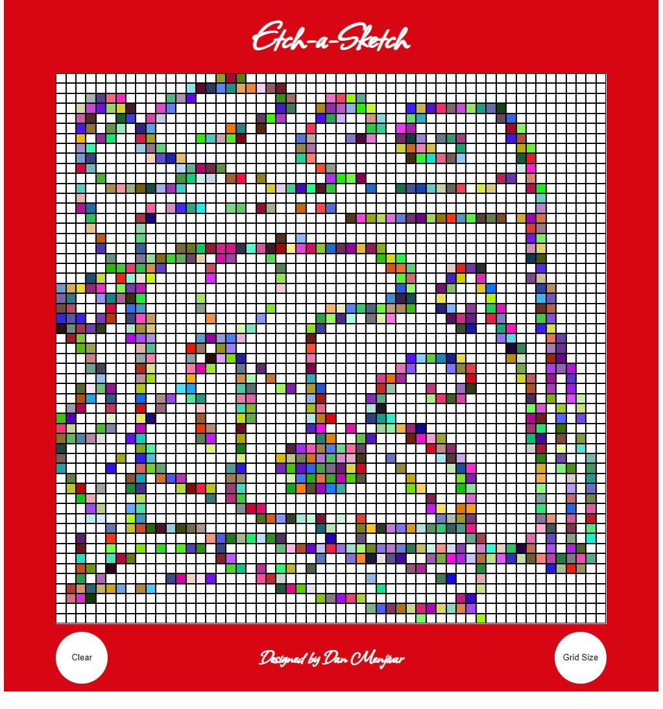

# Etch A Sketch

### [Live Demo](https://danmenjivar.github.io/etch-a-sketch/)

#### 📝 Description
An Etch-A-Sketch toy recreation that runs on the web browser. This is part of the Odin Project curriculum. 

### 💡 Features
* Rainbow colors
* Clear screen button
* Resize grid up to 100 * 100 cells

#### 🛠️ Built with 
 * HTML
 * CSS
 * JavaScript
 
